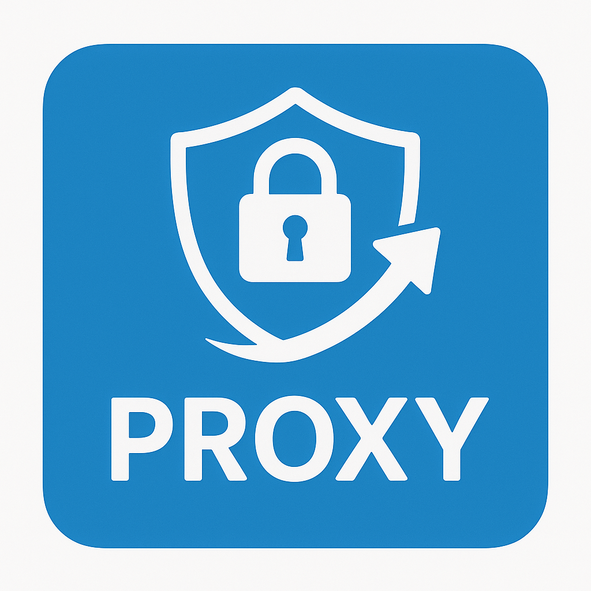

# Proxy Manager Extension

  

A lightweight browser extension for flexible proxy control. It lets you manage global proxy settings, define per-site behavior, and maintain your own list of proxies with authentication support. The popup UI gives instant visibility into which proxy rule applies to the current page.

---

## Features

### Global Proxy Mode

Enable a single proxy for all traffic. Supports HTTP, HTTPS, SOCKS4, and SOCKS5.

### Per-Site Rules

Assign specific routing for any domain:

- **NO_PROXY** — always direct
- **RANDOM_PROXY** — deterministic selection based on hostname
- **PROXY_BY_RULE** — fixed proxy by name
- **DIRECT (Temporary)** — bypass proxy until toggled off

### Page-Level Direct Mode

Temporarily disable proxying for the active tab’s domain.

### Proxy Management

Add and store your proxies, including optional credentials, protocol, and country label. All proxies are editable and removable.

### Import/Export

Backup or restore proxy lists and site rules in JSON format.

### Debug Logging

Toggle detailed debugging output for background proxy logic.

---

## Technical Stack

- Manifest V3
- JavaScript ES Modules
- Chrome Proxy API
- chrome.storage.sync
- PAC script generation for rule-based proxying
- Background service worker for routing logic
- Popup UI built with HTML/CSS/JS

---

## Installation

1. Download or clone the project.
2. Open **chrome://extensions/**.
3. Enable **Developer mode**.
4. Click **Load unpacked** and select the extension folder.

---

## Usage Overview

1. **Add proxies** in the _Proxies_ tab.
2. **Enable global mode** and select your preferred proxy.
3. **Create per-site rules** in the _Site Rules_ tab or use _Add rule for this site_.
4. **Use the temporary direct toggle** to bypass proxying for the current domain.
5. **Enable logging** via the small toggle button in the popup header.

---

## How Decisions Are Made

Proxy behavior follows this priority:

1. Temporary direct override
2. Most specific site rule
3. Global proxy
4. Direct connection

Advanced rules trigger automatic PAC script generation.

---
