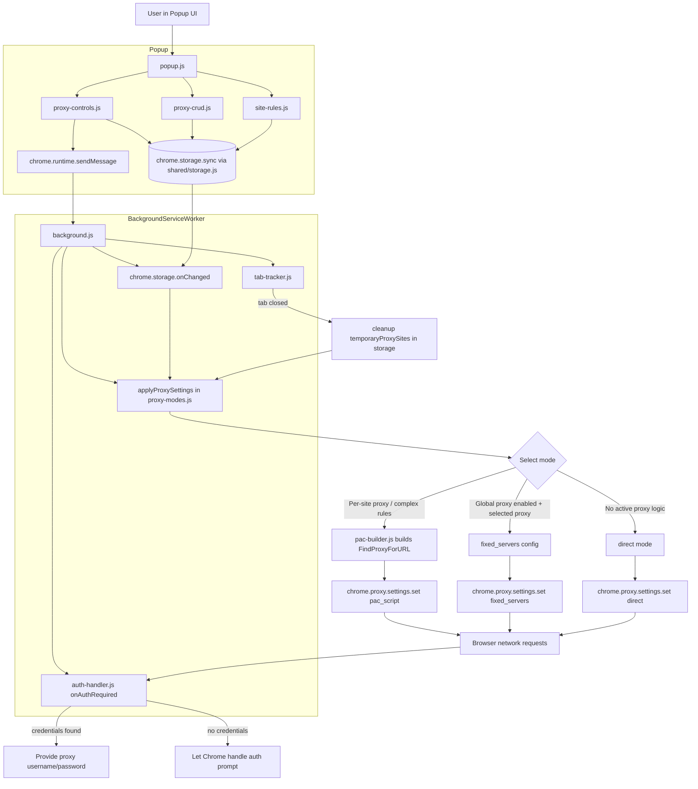

# Extension Architecture (Mermaid)

```mermaid
flowchart TD
  U[User in Popup UI] --> P[popup.js]

  subgraph Popup
    P --> PC[proxy-controls.js]
    P --> PR[proxy-crud.js]
    P --> SR[site-rules.js]
    PC --> S[(chrome.storage.sync via shared/storage.js)]
    PR --> S
    SR --> S
    PC --> M[chrome.runtime.sendMessage]
  end

  subgraph BackgroundServiceWorker
    B[background.js] --> AP[applyProxySettings in proxy-modes.js]
    B --> AH[auth-handler.js onAuthRequired]
    B --> TT[tab-tracker.js]
    B --> CH[chrome.storage.onChanged]
    CH --> AP
    M --> B
  end

  S --> CH
  AP --> D{Select mode}

  D -->|Per-site proxy / complex rules| PAC[pac-builder.js builds FindProxyForURL]
  PAC --> CP1[chrome.proxy.settings.set pac_script]

  D -->|Global proxy enabled + selected proxy| FIX[fixed_servers config]
  FIX --> CP2[chrome.proxy.settings.set fixed_servers]

  D -->|No active proxy logic| DIR[direct mode]
  DIR --> CP3[chrome.proxy.settings.set direct]

  CP1 --> NET[Browser network requests]
  CP2 --> NET
  CP3 --> NET

  NET --> AH
  AH -->|credentials found| AUTH1[Provide proxy username/password]
  AH -->|no credentials| AUTH2[Let Chrome handle auth prompt]

  TT -->|tab closed| CLEAN[cleanup temporaryProxySites in storage]
  CLEAN --> AP
```
